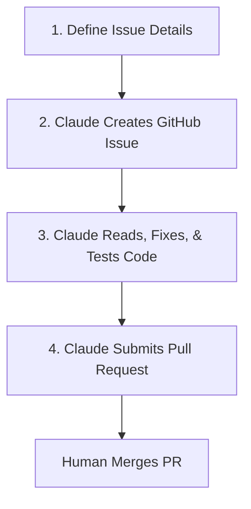

# Claude Handover & AI Development Guide

This guide is designed for a non-technical project owner and Claude (the AI Assistant) to collaborate on developing, testing, and shipping code for the **hsr** project.

---

## Part 1: Mac Development Setup (For the Non-Technical Owner)

Before Claude can start developing, you need to configure a local environment on your Mac. Follow these step-by-step instructions. You can copy-paste these commands directly into your macOS **Terminal** app (press `Cmd + Space`, type `Terminal`, and hit `Enter`).

### Step 1: Install Homebrew (Mac Package Manager)
Homebrew makes installing developer tools extremely easy. Copy, paste, and run this command:
```bash
/bin/bash -c "$(curl -fsSL https://raw.githubusercontent.com/Homebrew/install/HEAD/install.sh)"
```
*Note: Follow the on-screen instructions. You might be asked to enter your Mac password or run a couple of commands to add Homebrew to your shell path.*

### Step 2: Install Git, Node.js, and GitHub CLI
Run the following command to install the required tools:
```bash
brew install git node gh
```

### Step 3: Configure Git
Set up your git name and email (replace with your name and email):
```bash
git config --global user.name "Your Name"
git config --global user.email "your.email@example.com"
```

### Step 4: Login to GitHub CLI (`gh`)
Run this command to link your terminal with GitHub:
```bash
gh auth login
```
Follow these selections:
1. **What account do you want to log into?** Choose `GitHub.com`.
2. **What is your preferred protocol for Git operations?** Choose `HTTPS` (or `SSH` if you already have SSH keys set up).
3. **Authenticate Git with your GitHub credentials?** Choose `Yes`.
4. **How would you like to authenticate GitHub CLI?** Choose `Login with a web browser`.
5. Copy the one-time code shown in the terminal, press `Enter`, and paste the code into the web page that opens.

### Step 5: Clone the Repository
Go to the folder where you want to keep your project (e.g., your Documents folder) and clone the repository:
```bash
cd ~/Documents
git clone https://github.com/your-username/hsr.git
cd hsr
```
*(Replace `https://github.com/your-username/hsr.git` with your actual repository URL)*

### Step 6: Install Project Dependencies
Run these commands in the root of the project to set up the frontend and backend:
```bash
# Install frontend packages
npm install

# Install backend packages
cd backend
npm install
cd ..
```

### Step 7: Configure Environment Variables (`.env`)
Verify that the following environment files exist:
- **Frontend Environment (`.env` in root folder):** Should contain:
  ```env
  VITE_API_URL=https://0g82gy1lng.execute-api.ap-south-1.amazonaws.com/prod/
  ```
- **Backend Environment (`backend/.env` in backend folder):** Should contain:
  ```env
  AWS_ACCESS_KEY_ID=your_access_key
  AWS_SECRET_ACCESS_KEY=your_secret_key
  AWS_REGION=ap-south-1
  CDK_DEFAULT_ACCOUNT=597088022793
  CDK_DEFAULT_REGION=ap-south-1
  ```

### Step 8: Configure AWS CLI credentials locally
To deploy or synthesize backend resources locally, you should install the AWS Command Line Interface (CLI) and configure your credentials.

1. **Install AWS CLI:**
   ```bash
   brew install awscli
   ```
2. **Run Configuration Wizard:**
   ```bash
   aws configure
   ```
3. **Provide Credentials:**
   When prompted, paste your AWS credentials:
   - **AWS Access Key ID**: Paste your `AWS_ACCESS_KEY_ID` (e.g. from `backend/.env`)
   - **AWS Secret Access Key**: Paste your `AWS_SECRET_ACCESS_KEY`
   - **Default region name**: Type `ap-south-1`
   - **Default output format**: Type `json`

---

## Part 2: The Issue-to-PR Flow (AI Workflow)

When you want to request a new feature or report a bug, follow these 4 steps with Claude.



### Step 1: Draft the Feature/Bug Description
Use the templates stored in `.github/ISSUE_TEMPLATE/` to write down your request. If you are unsure, just write a plain English description and ask Claude:
> *"Claude, I want to add [Feature/Bug description]. Help me compile this into a GitHub issue using our issue template formats."*

### Step 2: Have Claude Create the Issue
Once the description is ready, ask Claude to create the issue using the GitHub CLI:
```bash
# Example command Claude will run:
gh issue create --title "[Feature]: Add new patient form field" --body-file issue.md --label enhancement
```
Claude will return the **Issue Number** (e.g., `#12`).

### Step 3: Have Claude Fix the Issue & Run Tests
Instruct Claude to work on the issue:
> *"Claude, read GitHub issue #12, create a new branch, and write/test the solution."*

When Claude performs this task, it **must** strictly follow the instructions below:

#### 🤖 CLAUDE EXECUTION INSTRUCTIONS:
1. **Pull Latest Changes:** Always pull the latest code before working:
   ```bash
   git checkout main
   git pull origin main
   ```
2. **Create a Development Branch:**
   ```bash
   git checkout -b issue-<number>-<short-description>
   ```
3. **Locate & Modify Files:** Find relevant frontend or backend files and make changes carefully, preserving code patterns.
4. **Run Local Verifications & Manual Testing:**
   - **Frontend Verification:**
     Run `npm run lint` and `npm run build` to ensure there are no build or compilation errors.
   - **Backend Verification:**
     Navigate to `/backend` and run `npm run test` (uses Jest) and `npm run build` (compiles TypeScript) to verify tests and build integrity.
   - **CDK Local Deployment & Manual Testing:**
     To verify the entire cloud deployment locally and obtain the staging URL:
     1. Build the frontend production bundle (CDK uses these assets):
        ```bash
        npm run build
        ```
     2. Deploy the stack to AWS:
        ```bash
        cd backend
        npx cdk deploy --require-approval never
        ```
     3. Once deployed, copy the `WebsiteUrl` value from the terminal outputs (e.g., `http://medantairregistrywebsite-xxx.s3-website.ap-south-1.amazonaws.com`) and open it in a web browser to manually test the application.
5. **Run the App Locally (Development Mode):**
   - Launch Frontend: `npm run dev` (runs Vite dev server).
   - Watch Backend compilation: `cd backend && npm run watch` (tsc watcher).

### Step 4: Have Claude Create a Pull Request (PR)
Once the tests pass and the feature is implemented, Claude must commit the changes and open a Pull Request:
```bash
# Example commands Claude will run:
git add .
git commit -m "feat: implement feature xyz (closes #12)"
git push origin issue-<number>-<short-description>
gh pr create --title "Fixes #12: Brief Description" --body "Closes #12. Implement changes for..." --web
```
The `--web` flag will open the PR page in your browser so you can do a quick visual review and click **Merge** when ready!

---

## Part 3: Fully Autonomous Developer Mode (Zero-Intervention)

If you are using an agentic coding assistant (such as Cursor, Cline, or Claude Code) where Claude has direct access to execute terminal commands on your Mac, you can automate the entire cycle with a **single prompt**.

### The One-Click Autonomous Prompt
Copy the prompt template below, fill in your feature request or bug details, and send it to Claude:

```text
Please act as my autonomous developer agent. Read the guidelines in Claude.md.

Here is the goal/problem description:
[PASTE YOUR FEATURE DESCRIPTION OR BUG REPORT HERE]

Your instructions:
1. Create a GitHub issue using the appropriate template in .github/ISSUE_TEMPLATE/.
2. Check out a local branch named after the issue.
3. Investigate the codebase, write the solution, and run local verifications (linting, build, and tests must pass).
4. Commit the code, push the branch, and create a Pull Request.
5. Configure the Pull Request to auto-merge.

You have full authority to execute terminal commands, edit files, and run git operations without asking me for confirmation at each step. Let's begin.
```

### How Claude Executes This Automatically
When given the above prompt, Claude will execute the following operations under the hood:

1. **Creates the Issue:**
   Saves the issue content based on the templates, then runs:
   ```bash
   gh issue create --title "[Feature/Bug]: <Title>" --body-file temp_issue.md --label <enhancement/bug>
   ```
   *Claude will parse the terminal output to extract the assigned issue number (e.g., `#12`).*

2. **Sets Up the Branch:**
   ```bash
   git checkout main && git pull origin main
   git checkout -b issue-12-short-name
   ```

3. **Implements & Verifies Changes:**
   Claude makes the necessary code edits, then verifies them:
   - **Frontend:** Runs `npm run lint && npm run build`
   - **Backend:** Runs `cd backend && npm run build && npm run test && cd ..`

4. **Pushes Code and Triggers Auto-Merge:**
   Claude submits the code and sets the PR to merge automatically:
   ```bash
   git add .
   git commit -m "feat/fix: address issue #12 (closes #12)"
   git push origin issue-12-short-name
   gh pr create --title "Fixes #12: Brief Description" --body "Closes #12" --fill
   gh pr merge --auto --merge --delete-branch
   ```
   *Note: For the `gh pr merge --auto` command to succeed, you must check the "Allow auto-merge" setting under your GitHub repository Settings (under General -> Pull Requests).*

---

## Part 4: Architecture Reference for Claude

When Claude is making changes, it should refer to the following structure of this repository:

### Tech Stack
- **Frontend:** React (v19) + Vite, CSS, React Router DOM (v7), Zustand (state management), React Hook Form, Tailwind CSS (if requested/used).
- **Backend:** Node.js + TypeScript, AWS CDK (for cloud infrastructure), AWS SDK, Jest (for backend testing).

### Project Layout
- `/src`: Frontend React source code.
  - `/src/steps`: Step-by-step form wizards (e.g., `Step1Demographics.jsx`, `Step3Ultrasound.jsx`).
- `/backend`: AWS CDK app and Lambda handler code.
  - `/backend/src/handlers`: Lambda functions (e.g., `createCase.js`, `createDoctor.js`).
  - `/backend/test`: Backend testing files (Jest).
  - `/backend/lib`: CDK stack definition files.

---

## Part 5: Automated GitHub Actions Deployment (CI/CD)

The project includes an automated deployment pipeline using **GitHub Actions**. Whenever you push or merge a Pull Request into the `main` branch, the pipeline will automatically compile the latest frontend code, build the backend TypeScript, and deploy the entire CDK stack to AWS.

### Setting Up GitHub Repository Secrets
For the pipeline to deploy successfully, you must add your AWS credentials as secrets in your GitHub repository:

1. On GitHub, navigate to your repository homepage.
2. Click on the **Settings** tab.
3. In the left sidebar, click **Secrets and variables** -> **Actions**.
4. Click the green **New repository secret** button.
5. Add the following three secrets:
   - **Name**: `AWS_ACCESS_KEY_ID`
     - **Value**: *(Your AWS access key)*
   - **Name**: `AWS_SECRET_ACCESS_KEY`
     - **Value**: *(Your AWS secret key)*
   - **Name**: `AWS_REGION`
     - **Value**: `ap-south-1` (or your chosen region)

Once configured, the next push to `main` will trigger the deploy workflow under the **Actions** tab of your repository!
